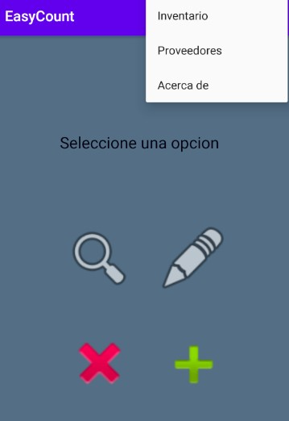
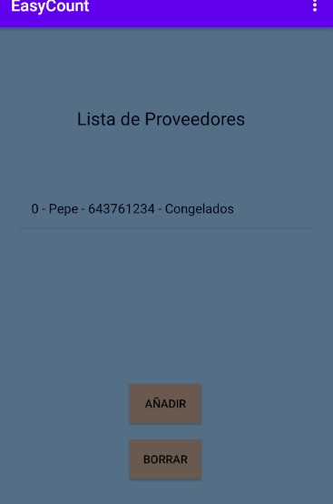
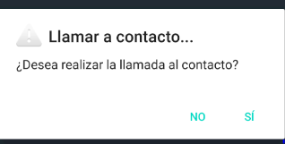
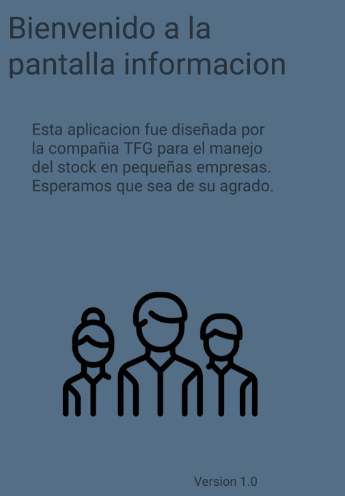

# EasyCount
Proyecto de Fin de Grado DAM
# Descripcion

El proyecto consiste en una aplicación Android capaza de gestionar el inventario de una pequeña empresa de alimentación en la cual el administrador de la aplicación podrá gestionar una base local en SQLite, eliminando, modificando o consultando artículos mediante un código identificativo. Asimismo, dispondrá de una base de datos con proveedores mediante la cual se podrá establecer contacto telefónico con ellos.

# Manual de Usuario

El siguiente manual está diseñado para ser una guía básica para la utilización de la aplicación de dispositivo móvil EsayCount destinada a la gestión del inventario por parte de pequeñas y medianas empresas.

En la página principal de dicha herramienta es posible acceder a un menú desplegable que nos lleve a ver la lista de proveedores o información sobre la aplicación. Asimismo, en esta pantalla también será posible gestionar el inventario mediante los diferentes botones contenidos en la misma.

Al acceder a la lista de proveedores mediante el menú podremos realizar distintas acciones mediante los botones para actualizar la lista pulsando en la lista. Esto último hará que emerja una ventana con la cual podemos efectuar una llamada al proveedor listado.

Por último, el usuario puede acceder a una pantalla de agradecimientos que consta de la versión de la aplicación.

The following manual is designed to be a basic guide for the use of the EsayCount mobile device application for inventory management by small and medium-sized companies.

On the main page of this tool it is possible to access a drop-down menu that takes us to see the list of providers or information about the application. Likewise, on this screen it will also be possible to manage the inventory using the different buttons contained therein.

When accessing the list of suppliers through the menu, we can perform different actions using the buttons to update the list by clicking on the list. The latter will bring up a window with which we can make a call to the listed provider.

Finally, the user can access a thank you screen that consists of the version of the application.

